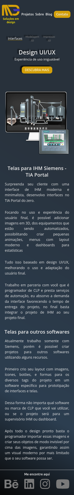

# Web site Mundo em 3D - M3D

Site para divulgação dos meus serviços, em paralelo criei um blog para ajudar e disseminar conhecimentos sobre o mundo open source e Linux para todos.

 
 

🖥️ Versão web                                             | 📲 Versão Mobile
:----------:                                           |  :--------------:
  |   

## Conheça meu [site aqui.](https://mundoem3d.com/)

Funcionalidades:

- [X] Site adaptado para pessoas com deficiência
- [X] Usado HTML semântico

## 🧰 Tecnologias utilizadas

A ídeia era ter um site rápido e bonito mas principalmente acessível a pessoas com deficiência, foquei na responsividade do site e na acessibilidade como pilares para o projeto.

- CSS
- HTML
- Javascript

📚 Biblioteca utilizada:
- [jQuery](https://jquery.com/)

## 🔥 Próximos passos
- [ ] Criar barra de pesquisa funcional na página Blog;
- [ ] Criar contador de post por categoria na página Blog;

## 😓 Dificuldades do projeto
Havia muito tempo que eu não trabalhava com HTML, então tive um tempo de reaprendizado seguindo alguns tutoriais e aprendendo sobre novas tag e estilos css como: flexbox, seletores, animações com keyframes e transitions. 

Apesar das dificuldades acredito que consegui um bom resultado e espero melhora-lo ainda mais daqui para frente.

## 🙏🏻 Agradecimentos

Alguns conteúdos de tutoriais foram fundamentais para que eu pudesse me desenvolver, então agradeço as pessoas que disponibilizam dicas e ensinam o que sabem na internet, seja pelo Youtube ou qualquer outro meio.

#### Conceitos de FlexBox:
- [Rafa Ballerini](https://github.com/rafaballerini) - *Usado em todas as páginas*
#### Tutorial no youtube de formulário contato:
- [Tiger Codes](https://github.com/tigercodes-io) - *Usado na página Contato*
#### Tutorial de Blog só com HTML e CSS:
- [Carpool Venom](https://www.youtube.com/c/CarpoolVenom) - *Usado na página Blog e Posts do blog*
